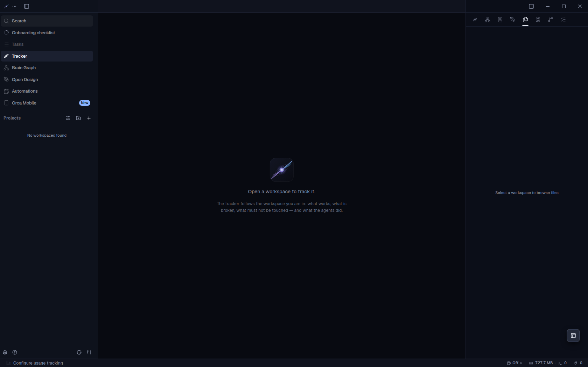
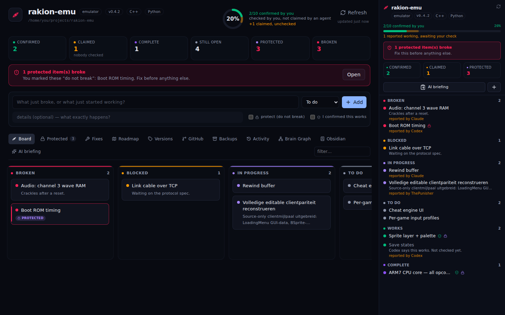
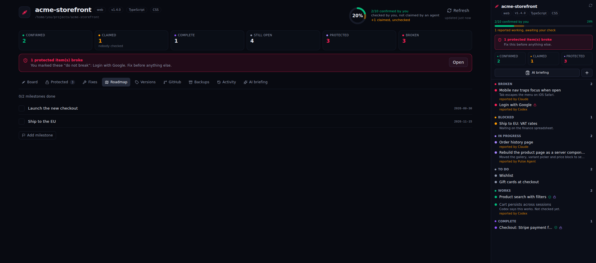
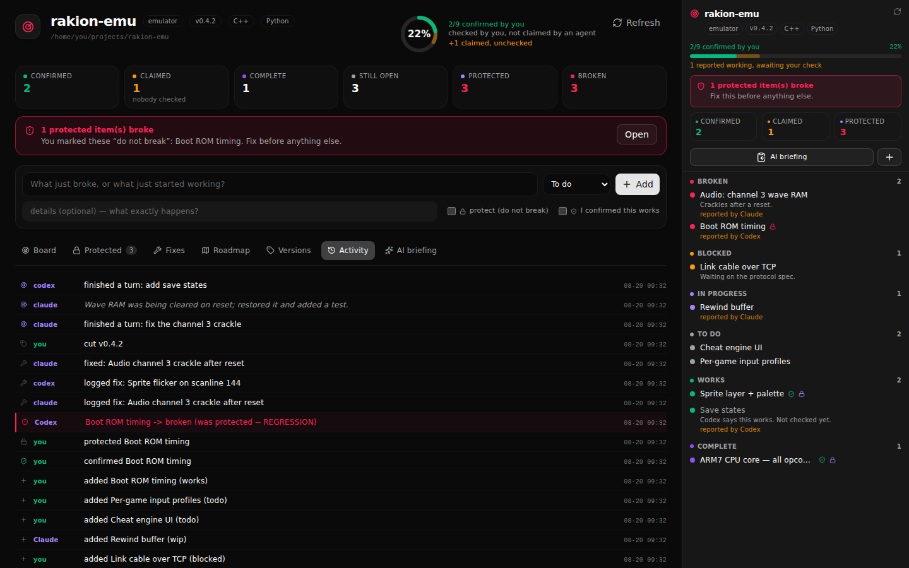

<div align="center">


# PulsarIDE

<sub>The product is **PulsarIDE**; the repository is still named `PlanIDE`.</sub>

**An agentic IDE that tracks its own work.**

Claude Code, Codex, Antigravity, Gemini, Cursor, Copilot and friends running in
parallel — with a project tracker built into the sidebar that knows what works,
what's broken, and what the agents just fixed.

</div>

---

## What it is

PulsarIDE is [Orca](https://github.com/stablyai/orca) (MIT — a next-gen IDE for
parallel agentic development, with 40+ CLI agents, git worktree isolation, a
built-in browser and terminals) **rebranded as PulsarIDE and extended with a
native project tracker**.

The missing half of agent-driven development isn't running the agents — Orca
already nails that. It's keeping track of **what actually works**, what broke,
what got fixed and by which agent, and how far along the project is. That's what
PulsarIDE adds, in the sidebar, wired to the agents.

| | |
|---|---|
| **The IDE** | Orca upstream, untouched: parallel worktrees, terminal splits, Design Mode, GitHub/Linear, SSH worktrees, AI diff annotation, the CLI, the mobile companion |
| **The tracker** | Board (works/broken/blocked/wip/todo), fix log with agent attribution, roadmap, versions, stack auto-detect, AI briefing export |
| **Ship it** | GitHub tab: branch state, the large-file scan GitHub will otherwise reject you for, one-click LFS, commit + push — or push by itself once changes settle |
| **Backups** | Zip snapshots of the project *and* the board, taken before you let an agent near something load-bearing |
| **The wiring** | Agents update the tracker themselves — via CLI or MCP — while they work |
| **No moving parts** | The tracker is main-process code inside the IDE: no server, no port, no extra runtime |
| **The trust layer** | "An agent says it works" and **"you confirmed it works"** are tracked as two different things, and agents cannot cross that line |
| **Protection** | Mark work **do not break** — agents are told it is off-limits, and breaking it raises a regression |
| **Pulse Agent, pre-installed** | 100 team leads + **5,372 named specialists** + 51 skills + a **274-role agency library** and **44 ThreeUI 3D/design components** ship inside the app and deploy on launch — Claude Code, Codex and Gemini CLI as native subagents, Antigravity as its own Skill, Cursor as an always-applied rule, opencode through its own config — with graphify + Obsidian wired per project and the `planide` and `pulsar-tools` MCP servers registered, so every agent updates the board out of the box |
| **The agent's own tools, everywhere** | `pulsar-tools` gives any agent — Codex and Cursor included, not just Claude Code — task routing across the whole roster, an anti-loop check so a failed approach is never retried, and binary triage through the bundled RE toolkit |
| **Automatic trail** | Every agent turn lands in Activity by name, straight from Orca's own agent hooks — nothing to install or call |
| **Live board** | The tracker watches the project, so an agent writing to the board updates what you are looking at — no refreshing |
| **Brain Graph** | What the project's knowledge graph actually holds: size, the pieces everything hangs off, how things relate, and how much was read from the code versus inferred — plus **Rebuild**, which re-indexes the project for real and surfaces graphify's own report: god nodes, connections you did not know about, import cycles, and what it still cannot answer |
| **Obsidian** | The vault, this project's note with a preview, and every project the agent has remembered |
| **Archify** | Ask an agent to diagram the project and it appears here: architecture, workflow, sequence, data-flow and lifecycle diagrams as interactive HTML, drawn from the real code rather than invented. Kept in `.planide/diagrams` beside the board, with a re-render when the source moves on |
| **Spec-driven development** | GitHub's Spec Kit workflow, bundled: specification, then plan, then task breakdown, then code — each stage landing on the board as it goes. Nothing to install |
| **Better prompts** | Prompt Master ships with the app, so any agent can write a proper prompt for another tool instead of guessing at one |
| **Its own theme** | Red on near-black — the palette the Pulse mark is drawn in — in light and dark, with every text pair contrast-checked in both. Not Orca's grey |
| **Updates itself** | Orca's own updater, pointed at PulsarIDE releases: it checks every two hours and fetches a new version in the background, so it is ready the moment you agree to install it |



<sub>The IDE itself. **Tracker**, **Brain Graph**, **Open Design** and **Archify** sit
together in the left sidebar -- each one a full page, and each also available as
a side panel while you work.</sub>



<sub>The Tracker page and the sidebar panel, side by side. Green is what **you**
confirmed; amber is what an agent merely claimed.</sub>



<sub>**Roadmap** is where the phases of a bigger plan live. Agents add
milestones as they plan and tick them off as they land; you see how far the
project actually is, not how busy it has been.</sub>

## Claimed vs. confirmed

The failure mode of agent-driven development is a board full of green that
nobody checked. So PulsarIDE splits progress in two:

- an agent moving an item to `works` records a **claim**, attributed to that
  agent (`reported by Codex`);
- **only you** can mark it **confirmed** — in the IDE, or
  `./agent-tools/plan item confirm <project-path> <id>`.

The sidebar shows both: a solid green bar for what you confirmed, a faint amber
one behind it for what is merely claimed. Project health is scored on the
confirmed number, not the claimed one. Changing an item's status drops its
confirmation, so a confirmation always refers to what you actually saw.

The boundary is enforced, not just documented: the update path cannot set
`verified` (a runtime allowlist, not just a type), and the MCP server agents use
exposes no confirm tool at all — both covered by tests.

## Your board: two axes, not one

You enter what you know; agents fill in the rest. Every item has a **status**
(the state it is in) and, separately, **your flags** — which only you can set.

| Status | |
|---|---|
| `todo` · `wip` | still to be done |
| `works` | it functions |
| `done` | **complete** — finished and closed out |
| `broken` · `blocked` | needs attention |

| Your flags | |
|---|---|
| ✓ **confirmed** | you checked it yourself — not a claim |
| 🔒 **protected** | **do not break this**: load-bearing work agents must leave alone |

Protection is the one that saves you: agents love to "improve" something that
already worked. Every AI briefing leads with a **DO NOT BREAK** list, and if a
protected item ever goes to broken, PulsarIDE raises a **regression** — a red
banner in the GUI and in the IDE panel, the first line of the briefing, and a
hard hit to the project's health score.

The update path can set neither `verified` nor `locked` — enforced by a runtime
allowlist, because it is reachable over IPC with arbitrary JSON — and the MCP
surface agents use exposes no tool for either. So an agent can never confirm its
own work or unprotect the thing it is about to rewrite. All of it is covered by
tests on both sides.

**Activity** records every change with attribution, so you can see exactly what
you did versus what Claude or Codex did — including the line that says which
agent broke something you had protected.



<sub>The trail reads at a glance: a regression is loud, an agent's own words are
in italics, and every line says who did it.</sub>

## Get it

Windows: grab **`pulsar-windows-setup.exe`** from
[Releases](https://github.com/ThePunisherai/PlanIDE/releases) and run it.
Linux: the `.AppImage` from the same page (`chmod +x`, then run).

Every release is built by GitHub Actions on a real Windows runner
(`.github/workflows/release.yml`): it clones Orca at the pinned revision,
applies the overlay, and packages it with Orca's own release scripts. Nothing is
built by hand.

## Build it

```bash
git clone https://github.com/ThePunisherai/PlanIDE.git
cd PlanIDE
./ide/build.sh --run
```

That clones Orca at a pinned revision, applies the PulsarIDE overlay (branding +
tracker panel + engine wiring), installs, and starts the IDE. Needs `git`,
`python3` and [`pnpm`](https://pnpm.io).

Everything lives **inside the IDE**, in two places:

- **Tracker** in the left nav (radar icon) — the full workbench: quick capture,
  the whole board, Protected, Fixes, Roadmap, Versions, GitHub, Backups,
  Activity, **Brain Graph**, **Obsidian**, and the AI briefing.
- The **right-sidebar panel** (same radar icon) — the glanceable version you
  keep open while an agent works: progress, regressions, open fixes, and
  one-click confirm/protect without leaving your code.

There is no web UI, no server and no port: the tracker is main-process
TypeScript, reached over IPC like every other part of Orca. It reads and writes
each project's own `.planide/state.json` directly.

## Repo layout

```
PlanIDE/
├── ide/                    everything that becomes the IDE
│   ├── overlay/src/main/planide/    the tracker itself (main process):
│   │                                store · detect · report · git · backup · ipc
│   ├── overlay/src/preload/         the typed IPC bridge
│   ├── overlay/src/renderer/…       the Tracker page + sidebar panel
│   ├── agent-bundle/       Pulse Agent itself: 100 team leads, 51 skills, the
│   │                       memory hooks, the RE toolkit, and the tracker MCP
│   │   ├── agency-agents/  274 role agents, 19 divisions (MIT, vendored) — read
│   │   │                   inline, never registered, so the subagent budget holds
│   │   └── design/threeui/ 44 React + three.js components (MIT, source only)
│   ├── design/             the harness that renders the real surfaces in a
│   │                       browser, so a design change is checked, not guessed
│   ├── apply.py            anchored, verified, idempotent integration + branding
│   ├── build.sh            clone Orca → apply → install → run
│   ├── test/               the tracker's own behaviour tests
│   └── verify.sh           tracker tests + does the overlay still apply upstream?
├── agent-tools/            how agents update the tracker from a terminal
│   ├── planide/            the `plan` CLI (zero dependency)
│   └── mcp/                MCP server for MCP-native agents
├── docs/
└── verify.sh               runs both suites
```

Both sides write the same file, `<project>/.planide/state.json`. That format is
the contract between them, and `agent-tools/scripts/verify.sh` checks the IDE's
tracker can read a state the agent tools just wrote — so two implementations of
one format cannot quietly drift apart.

### Why an overlay instead of a 210 MB vendored fork

Upstream Orca moves fast. Keeping only *our* code in `ide/overlay/**` and
re-applying it onto a pinned upstream revision means an upstream bump is one
line (`PINNED_COMMIT` in `ide/apply.py`) instead of a merge conflict across
16 000 files. Every edit is anchored to an exact upstream string and verified —
if upstream drifts, `apply.py` fails loudly naming the file, instead of
silently producing a half-patched IDE.

**Nothing Orca does is removed.** The overlay adds 28 files, replaces 5 images
(the icons), and makes 46 anchored edits — the ones that rewrite a line rather
than add around it are branding constants (app name, bundle id, protocol,
executable names, release repo). `ide/check-additive.py` fails the suite if an
edit ever drops upstream code, so a feature cannot go missing quietly.

## Tracking *via* the agents

The point isn't exporting status to an agent — the agent should keep the tracker
current **as it works**.

**Nothing to wire up: turns are recorded automatically.** Orca already knows when
an agent finishes a turn, and PulsarIDE listens to that same signal — so every turn
lands in **Activity** under the agent's own name, even for agents that never call
anything below. It stays out of the board on purpose: a finished turn is not
evidence that something works, so it never moves an item. (Replays, duplicate
deliveries and an agent merely connecting are all ignored, and a project you
don't track is left alone.)

To have an agent update the board itself, two ways — pick per agent:

- **CLI** (zero dependency) — any shell-capable agent (Claude Code, Codex) runs:
  ```bash
  ./agent-tools/plan item set <project-path> <item_id> --status works
  ./agent-tools/plan fix done <project-path> <fix_id> --solution "awaited the query"
  ```
- **MCP** (nothing to install) — the `planide` server is registered for Claude
  Code, Codex, Cursor, Gemini CLI and Antigravity on launch, and agents call
  `get_board` / `add_item` / `set_item` / `add_fix` / `mark_fixed` /
  `add_milestone` / `set_milestone` / `add_version` directly. It is a
  zero-dependency Node server run by the IDE's own binary, so there is no Python
  and no `pip install` in the path.

Both write the same state the IDE reads, so a fix an agent logs mid-session
shows up in the Tracker.

## Verify

```bash
./verify.sh        # agent tools: 17 checks · IDE (tracker + overlay): 18 checks
```

## Credits & license

PulsarIDE is built on [stablyai/orca](https://github.com/stablyai/orca)
(MIT, © Lovecast Inc.) — all agent orchestration, terminals, worktrees and
editor surface are upstream's work. The tracker, the sidebar panel, the engine
wiring and the overlay tooling are PulsarIDE's.

PulsarIDE's own code is [Apache-2.0](LICENSE).
